# 南鲸商城 BlueWhale — 项目学习手册

> 本文面向**只会基础 CRUD、有一定开发功底的初级工程师**，目标是带你从「能看懂」到「能讲清楚」这个项目。
>
> 与 [项目说明.md](./项目说明.md)不同，本手册侧重 **「为什么这么设计 + 代码到底怎么跑」**，每个核心功能都配了**架构说明 + 关键真实代码 + 流程图**。流程图用 [PlantUML](https://plantuml.com/zh/) 文本描述，你可以用 IDE 插件 / [在线渲染器](https://www.plantuml.com/plantuml/uml) 直接出图，后续也可替换为自己画的图。

---

## 怎么用这份手册

| 你的目标             | 建议读法                                                                      |
| -------------------- | ----------------------------------------------------------------------------- |
| 5 分钟了解项目是什么 | 读[一、需求背景](#一需求背景三分钟搞懂这是个什么系统) + [三、功能地图](#三功能地图) |
| 准备面试 / 复盘讲解  | 重点读[五](#五核心实现逐个击破) 的每个「设计动机」与流程图                       |
| 上手改代码           | 先读[四、整体架构](#四整体架构一次请求的一生)，再按模块查 [五](#五核心实现逐个击破) |

> 配套文档：业务细节看 [实现说明.md](./实现说明.md)，决策的「为什么」看 [重要决策说明.md](./重要决策说明.md)，接口看 [api-spec.md](./api-spec.md)，踩坑看 [debug记录.md](./debug记录.md)。

---

## 一、需求背景（三分钟搞懂这是个什么系统）

**南鲸商城**是一个「专注国货品牌」的**多商户在线商城后端**——可以理解为一个迷你版「天猫 / 京东」的服务端。它不是单店铺商城，而是**一个平台上挂着很多家商店**，每家店有自己的店员管理商品和订单，平台有一个总管理员。

系统里有四类角色，权限层层递进：

| 角色                    | 是谁                           | 能干什么                                                                |
| ----------------------- | ------------------------------ | ----------------------------------------------------------------------- |
| **游客 Guest**    | 没登录的人                     | 只能「逛」：看商店、看商品、看评论                                      |
| **顾客 Customer** | 注册登录的买家                 | 购物车、下单、支付、收货、退款、评价、领券用券、找客服                  |
| **店员 Staff**    | 隶属于**某一家店**的员工 | 管理**本店**的商品/库存/订单（发货）/优惠券，看本店报表，接待客服 |
| **管理员 Admin**  | 平台唯一总管                   | 开店并绑定店员、发全局券、删分类、看全局报表                            |

一笔典型的业务主线是这样的（记住这条线，整个项目都是围绕它转的）：

```
游客浏览商品 → 注册成顾客 → 加购物车 → 选地址+优惠券下单
   → 模拟支付 → 店员发货 → 顾客确认收货 → 评价 → （可退款）
```

完整需求清单见 [requirements.md](./requirements.md)。

---

## 二、技术栈（为什么选它们）

对初级工程师来说，「用了什么」不重要，「**为什么用 + 它帮你省了什么**」才重要。

| 层次         | 选型                                                    | 它解决了什么问题                                                                                                    |
| ------------ | ------------------------------------------------------- | ------------------------------------------------------------------------------------------------------------------- |
| 语言         | **Java 17**                                       | LTS 长期支持版；用到了 `record`（不可变数据类）、文本块（`"""..."""` 写多行 SQL）等新特性                       |
| 框架         | **Spring Boot 3.4**                               | 约定大于配置，起一个 Web 服务、连数据库、依赖注入全帮你搞定                                                         |
| 构建         | **Maven**                                         | 管依赖、打包，`pom.xml` 一处声明                                                                                  |
| ORM          | **MyBatis Plus 3.5.9**                            | 在 MyBatis 上再封装一层：单表 CRUD / 分页 / 逻辑删除 / 字段自动填充**一行代码不用写 SQL**，复杂查询再手写 SQL |
| 安全         | **Spring Security（无状态）+ JWT（jjwt 0.12.6）** | 登录鉴权。无状态=服务端不存 session，token 自带身份，天然支持多实例水平扩展                                         |
| 数据库       | **MySQL 8.x**                                     | 关系型主存储                                                                                                        |
| 缓存/锁/状态 | **Redis（Lettuce 客户端 + 连接池）**              | 一个 Redis 身兼多职：存 refreshToken、热点读缓存、分布式锁、客服在线状态、推荐 ZSET                                 |
| 本地缓存     | **Caffeine**                                      | 进程内一级缓存（L1），命中就不用走 Redis 网络往返                                                                   |
| 校验         | **Jakarta Bean Validation**                       | 在 DTO 字段上贴 `@NotBlank/@Min` 等注解，请求一进 Controller 就自动校验                                           |
| 数据库迁移   | **Flyway**                                        | 把建表/改表脚本版本化（`V1__xxx.sql`），启动自动按序执行，环境之间结构永远一致                                    |
| 报表导出     | **EasyExcel**                                     | 注解式生成多 Sheet 的 xlsx，比原生 POI 省心                                                                         |
| 工具         | **Lombok**                                        | `@Data/@Builder/@RequiredArgsConstructor` 自动生成 getter/构造器，少写样板代码                                    |
| 测试         | **JUnit 5 + Mockito**                             | 单测以纯 Mockito 为主（不启动 Spring、不连库，跑得飞快）                                                            |
| 向量库       | **Qdrant（Docker 单容器，1024 维 / Cosine）**     | AI 语义搜索的向量索引；`RestClient` 直调 REST，零 SDK 依赖；不可用时自动降级关键词搜索                              |
| AI 模型      | **通义 DashScope**（`text-embedding-v3` + `qwen-plus`） | embedding（把文字变成向量）+ 生成（RAG/Agent 的对话）；两者共用一个 `DASHSCOPE_API_KEY`                       |
| 流式生成     | **Spring MVC `SseEmitter`**                       | RAG 导购问答 / AI 导购 Agent 的「打字机」流式输出，主线程秒返回、后台线程推流                                        |
| 可用性护栏   | **Resilience4j + Redis Lua 限流 + Actuator/Micrometer** | AI 链路熔断/重试（失败降级关键词搜索）+ 端点限流（20 req/60s）+ Prometheus 指标，让 AI 功能「挂了也不拖垮主站」    |

> 💡 **给初学者的一个重要观念**：上面这些「进阶」依赖（Redis、Flyway、EasyExcel）都是**为了解决某个具体痛点才引入的**，不是为了堆技术。读代码时多问一句「不用它会怎样」，理解会深很多。

---

## 三、功能地图

把全部 16 个业务模块按「主线 + 支撑 + 进阶 + AI」分四类看，更容易抓重点：

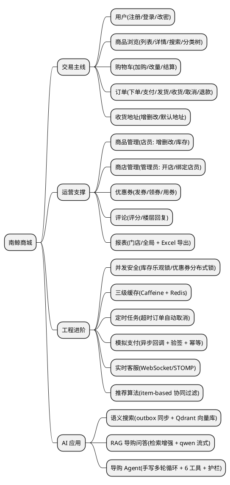

接口数量级：**约 63 个 REST 接口 + 2 个 STOMP 消息端点 + 2 个 Actuator 端点**，18 张表。完整清单见 [api-spec.md](./api-spec.md)。

---

## 四、整体架构：一次请求的一生

### 4.1 分层架构

项目是非常标准的 **Spring 三层架构 + 无状态安全过滤链**。先记住这张图，后面所有代码都能对号入座：

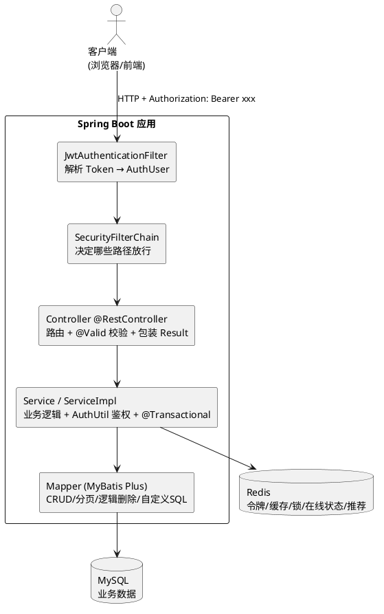

每层职责（**这是面试高频题，务必能脱口而出**）：

- **Filter（过滤器）**：只做一件事——**解析** token 拿到「你是谁」（userId/role/storeId），写进 `SecurityContext`。它**不判断**「你能不能做这件事」。
- **Controller**：管路由、用 `@Valid` 校验请求参数格式、把 Service 的返回值统一包成 `Result<T>`。**不写业务逻辑**。
- **Service**：真正的业务逻辑所在地。**鉴权（你能不能做）也在这里**，用 `AuthUtil.requireRole(...)`。事务边界 `@Transactional` 也打在这层。
- **Mapper**：跟数据库打交道。简单 CRUD 直接继承 MyBatis Plus 的 `BaseMapper` 白嫖，复杂聚合（`GROUP BY/SUM`）才手写 SQL。

> 🔑 **本项目最值得学的一个设计**：**「鉴权(authentication) 与 授权(authorization) 分离」**——Filter 只负责认证「你是谁」，Service 层的 `AuthUtil` 负责授权「你能干嘛」。好处是授权逻辑集中、贴近业务、好做单元测试。详见 [5.3](#53-鉴权无状态-jwt--认证授权分离)。

### 4.2 三条入口通道

除了上面的 HTTP 主通道，还有两条**非 HTTP** 的执行路径，初学时容易忽略：

| 通道                          | 触发方式     | 典型用途               | 关键点                                                  |
| ----------------------------- | ------------ | ---------------------- | ------------------------------------------------------- |
| **HTTP REST**           | 客户端请求   | 绝大多数功能           | 有 `SecurityContext`                                  |
| **WebSocket/STOMP**     | 长连接推消息 | 实时客服               | **没有** `SecurityContext`，鉴权在 STOMP 帧里做 |
| **定时任务 @Scheduled** | 时间触发     | 超时订单取消、推荐重建 | **没有** `SecurityContext`，是「系统身份」      |

> 后两条通道为什么特殊？因为 `SecurityContext` 是**绑定在 HTTP 请求线程上的**（ThreadLocal）。WebSocket 和定时任务跑在别的线程上，拿不到它，所以鉴权方式不一样。记住这点，看 §5.9 模拟支付 和 §5.11 实时客服 就不会懵。

### 4.3 横切基础设施

这些是「到处都在用」的公共件：

- `Result<T>`：统一响应体 `{code, message, data}`，全项目所有接口都返回它。
- `GlobalExceptionHandler`：`@RestControllerAdvice`，把异常统一翻译成 `Result`（校验失败→400、`BusinessException`→自带码、其余→500）。
- `CacheUtil` / `RedisLockUtil`：三级缓存、分布式锁工具。
- `AuthUtil`：角色/归属鉴权。
- Flyway 迁移脚本：`V1~V7` + `R__` 种子。

---

## 五、核心实现逐个击破

> 下面每一节的固定结构：**① 它解决什么问题 → ② 架构/流程图 → ③ 关键代码 → ④ 给初学者的提醒**。
> 没读过的同学建议按顺序读 5.1 → 5.5，进阶部分（5.6 起）可按兴趣跳读。

### 5.1 统一响应与全局异常：让前端永远拿到一样的结构

**问题**：如果每个接口各返回各的格式（有的返回对象、有的返回字符串、报错有的 500 有的乱七八糟），前端要写无数种解析逻辑，痛不欲生。

**做法**：所有接口统一返回 `Result<T>`，所有异常统一由 `GlobalExceptionHandler` 兜底翻译。

`Result<T>` 是一个**不可变值对象**（字段 `final`、只能通过静态工厂方法创建）：

```java
// common/Result.java（简化）
public class Result<T> {
    public static final int CODE_SUCCESS = 200;
    public static final int CODE_BAD_REQUEST = 400;
    public static final int CODE_UNAUTHORIZED = 401;
    public static final int CODE_FORBIDDEN = 403;
    public static final int CODE_NOT_FOUND = 404;

    private final int code;
    private final String message;
    private final T data;

    public static <T> Result<T> success(T data) { return new Result<>(CODE_SUCCESS, "success", data); }
    public static <T> Result<T> badRequest(String msg) { return new Result<>(CODE_BAD_REQUEST, msg, null); }
    // ... unauthorized / forbidden / notFound
}
```

业务代码里抛 `BusinessException`，由全局处理器统一转成 `Result`：

```java
// exception/GlobalExceptionHandler.java（核心思想）
@RestControllerAdvice
public class GlobalExceptionHandler {

    // 业务异常：用异常自带的 code（默认 400）
    @ExceptionHandler(BusinessException.class)
    public Result<Void> handle(BusinessException e) {
        return new Result<>(e.getCode(), e.getMessage(), null);
    }

    // @Valid 校验失败：把所有字段错误拼起来，一次性告诉前端
    @ExceptionHandler(MethodArgumentNotValidException.class)
    public Result<Void> handle(MethodArgumentNotValidException e) {
        String msg = e.getBindingResult().getFieldErrors().stream()
                .map(FieldError::getDefaultMessage).collect(Collectors.joining("; "));
        return Result.badRequest(msg);
    }
    // 其余未捕获异常 → 500
}
```

**给初学者的提醒**：

- `BusinessException` 默认码是 **400 而不是 500**——因为业务失败（库存不足、状态不对）是「客户端请求不合理」，属于 4xx；500 是「服务端自己崩了」。把两者分清是工程素养。
- 校验错误「一次性返回全部」而非只报第一条，是为了用户体验（一次改完，不用反复试）。

### 5.2 MyBatis Plus 的几个「全局约定」（不懂这些会看不懂代码）

项目大量依赖 MyBatis Plus 的全局行为，初学者第一次看代码常常困惑「这 SQL 哪来的」。三个必须知道的约定：

1. **逻辑删除**：表里有 `deleted` 字段（0=正常，1=删除）。配置开启后，**所有查询自动追加 `WHERE deleted = 0`**，`removeById` 实际执行的是 `UPDATE ... SET deleted = 1`。所以你看不到 `WHERE deleted=0` 不代表没过滤。
2. **字段自动填充**：`createTime`/`updateTime` 由 `MyMetaObjectHandler` 在 insert/update 时自动塞值，业务代码不用手动 set。
3. **逻辑分页**：`MybatisPlusConfig` 注册了分页插件，Service 里 `this.page(new Page<>(page, size), wrapper)` 就能自动分页。

还有一个**反复出现的代码套路**——**「二次批量查询」防 N+1**。比如订单列表要显示「店铺名」，错误写法是循环里一条条查店铺（N+1 次查询）。本项目统一这样写：

```java
// 收集本页所有 storeId → 一次性批量查 → 放进 Map → 回填
List<Long> storeIds = orders.stream().map(Order::getStoreId).distinct().toList();
Map<Long, String> storeNameMap = new HashMap<>();
storeMapper.selectBatchIds(storeIds).forEach(s -> storeNameMap.put(s.getId(), s.getName()));
// 后面组装 VO 时直接 storeNameMap.get(o.getStoreId())
```

> 为什么不用 JOIN？因为 `selectBatchIds` 走主键索引极快，两次简单查询通常比一次复杂 JOIN 还快，而且 Service 组装 VO 比维护 ResultMap 清晰。这是本项目的明确决策（[重要决策 #16](./重要决策说明.md)）。

### 5.3 鉴权：无状态 JWT + 认证/授权分离

**问题**：HTTP 是无状态的，每个请求都得证明「我是谁」。传统做法是服务端存 session，但多实例部署时 session 不好共享。**JWT** 把身份信息**签名后塞进 token 自身**，服务端不存任何东西，验签通过就认。

**整体流程**：

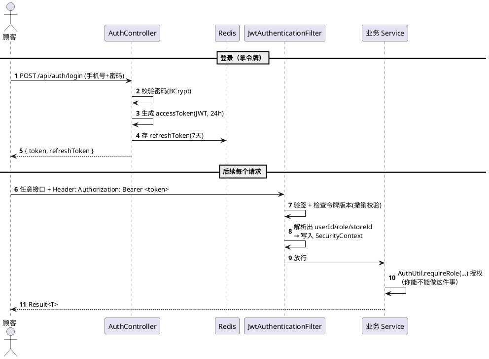

**关键代码 1：Filter 只负责「认证」**（注意它从不判断权限）：

```java
// filter/JwtAuthenticationFilter.java
String header = request.getHeader("Authorization");
if (header == null || !header.startsWith("Bearer ")) {
    chain.doFilter(request, response); return;   // 没带 token，放行（后续由 SecurityChain 决定拒不拒）
}
String token = header.substring(7);
if (!jwtUtil.isValid(token)) { chain.doFilter(request, response); return; }  // 验签失败也放行（当未登录处理）

Long userId = jwtUtil.getUserId(token);
// 即时撤销：退出登录/改密后令牌版本号会变，旧 token 即便没过期也失效
if (!tokenVersionStore.isCurrent(userId, jwtUtil.getTokenVersion(token))) {
    chain.doFilter(request, response); return;
}
AuthUser authUser = new AuthUser(userId, jwtUtil.getRole(token), jwtUtil.getStoreId(token));
SecurityContextHolder.getContext().setAuthentication(
        new UsernamePasswordAuthenticationToken(authUser, null, List.of(new SimpleGrantedAuthority(role))));
chain.doFilter(request, response);
```

**关键代码 2：Service 层负责「授权」**：

```java
// util/AuthUtil.java
public static AuthUser requireRole(String... roles) {
    AuthUser user = getCurrentUser();   // 从 SecurityContext 取；没有就抛 401
    if (Arrays.stream(roles).noneMatch(r -> r.equals(user.role()))) {
        throw new BusinessException(Result.CODE_FORBIDDEN, "权限不足");   // 角色不对 → 403
    }
    return user;
}
public static void requireStoreAccess(Long storeId) {   // 店员只能操作自己的店
    if (!storeId.equals(getCurrentUser().storeId())) {
        throw new BusinessException(Result.CODE_FORBIDDEN, "无权操作该商店");
    }
}
```

**关键代码 3：哪些路径不需要登录**——在 `SecurityConfig` 里精确放行：

```java
// config/SecurityConfig.java
.authorizeHttpRequests(auth -> auth
    .requestMatchers("/api/auth/**").permitAll()          // 登录注册
    .requestMatchers(HttpMethod.GET,                      // 只放行 GET 浏览类
        "/api/categories", "/api/stores", "/api/stores/*",
        "/api/stores/*/products", "/api/products", "/api/products/*",
        "/api/products/*/reviews", "/api/products/*/recommendations"
    ).permitAll()
    .requestMatchers("/ws/**").permitAll()                // WS 握手放行，鉴权在 STOMP 帧
    .requestMatchers("/api/payments/notify").permitAll()  // 支付回调，靠 HMAC 验签
    .anyRequest().authenticated()                          // 其余一律需登录
)
```

**给初学者的提醒**：

- 注意路径用**单段通配符 `*`**（只匹配一段）而不是 `**`。`/api/stores/*` 只放行「商店详情」，**不会**误放行 `/api/stores/*/orders`（店铺订单，必须店员鉴权）。这是个容易出安全漏洞的细节。
- Staff 的 `storeId` 被**写进 token**了，所以校验「是不是操作自己的店」不用查库，解析 token 就有。这是用空间（token 大一点）换时间（少查库）的典型权衡。
- **JWT 无状态的代价**：token 签发后服务端管不了它，没法「立刻让它失效」。本项目补了个 `TokenVersionStore`（令牌版本号），改密/登出时把版本号 +1，旧 token 的版本对不上就失效——这是给无状态 JWT 加了个「后悔药」。

### 5.4 下单：本项目最核心的业务流程（两阶段设计）

**问题**：下单牵涉一长串校验（购物车归属、地址、库存、优惠券）和一长串写库（扣库存、建订单、建明细、核销券、清购物车）。如果校验和写库交叉进行，万一写到一半某个校验不过，数据就脏了。

**做法**：**两阶段** —— **Phase 1 把所有只读校验做完，全部通过后，Phase 2 才统一写库**，整个方法 `@Transactional`，任一步失败全部回滚。

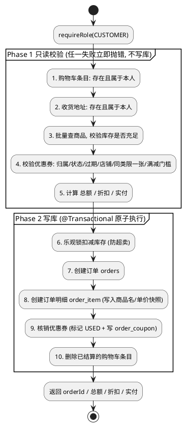

**关键代码**（节选自 `OrderServiceImpl.createOrder`，已加注释）：

```java
@Override
@Transactional
public CreateOrderResponse createOrder(Long userId, CreateOrderRequest request) {
    AuthUtil.requireRole(AuthUtil.ROLE_CUSTOMER);

    // ── Phase 1：全部校验 ──
    // 1. 购物车条目：批量查，数量对不上说明有不存在的；再验所有条目都属于本人的车
    List<CartItem> cartItems = cartItemMapper.selectBatchIds(request.getCartItemIds());
    if (cartItems.size() != request.getCartItemIds().size()) throw new BusinessException("部分购物车条目不存在");
    Cart cart = cartMapper.selectOne(new LambdaQueryWrapper<Cart>().eq(Cart::getUserId, userId));
    if (cart == null || cartItems.stream().anyMatch(i -> !cart.getId().equals(i.getCartId())))
        throw new BusinessException(Result.CODE_FORBIDDEN, "购物车条目不属于当前用户");

    // 2. 地址校验（略）  3. 批量查商品 + 库存校验
    Map<Long, Product> productMap = ...;   // selectBatchIds 一次查出
    for (CartItem item : cartItems) {
        Product p = productMap.get(item.getProductId());
        if (p == null) throw new BusinessException("商品不存在或已下架");
        if (p.getStock() < item.getQuantity()) throw new BusinessException("商品【" + p.getName() + "】库存不足");
    }

    // 4-5. 算总额、定店铺、校验并计算优惠券最优折扣
    BigDecimal totalAmount = computeTotal(cartItems, productMap);
    Long storeId = productMap.values().iterator().next().getStoreId();
    CouponResolution resolution = resolveCoupons(userId, totalAmount, storeId, request.getCouponIds());

    // ── Phase 2：写库 ──
    // 6. 逐个商品用乐观锁扣库存（防超卖，见 5.6）
    for (CartItem item : cartItems) deductStockWithOptimisticLock(item.getProductId(), item.getQuantity());

    // 7. 建订单（注意：地址是「快照」——把当时的省市区详细地址抄进订单，而不是只存 addressId）
    Order order = Order.builder().userId(userId).storeId(storeId).status("PENDING_PAYMENT")
            .totalAmount(totalAmount).discountAmount(...).payableAmount(...)
            .addrReceiverName(address.getReceiverName()).addrProvince(address.getProvince()) /* ... */.build();
    save(order);

    // 8. 建明细（同样把商品名、单价「快照」进去）
    for (CartItem item : cartItems) { /* insert OrderItem，写 productName/unitPrice 快照 */ }

    // 9. 核销券：标 USED + 写 order_coupon 关联表（支持一单多券）
    for (Coupon c : resolution.coupons()) { c.setStatus("USED"); /* ... */ orderCouponMapper.insert(...); }

    // 10. 清空已下单的购物车条目
    request.getCartItemIds().forEach(cartItemMapper::deleteById);
    return CreateOrderResponse.builder().orderId(order.getId())/* ... */.build();
}
```

**给初学者的提醒**：

- **「快照」思想非常重要**：订单里冗余存了下单时的地址、商品名、单价。为什么不存 `addressId`、`productId` 然后实时 JOIN？因为用户之后可能改地址、商家可能改价格/下架商品，**历史订单必须定格在下单那一刻**，否则「我买的时候 9 块 9，现在订单显示 19 块 9」就出大事了。（[重要决策 #4、#5](./重要决策说明.md)）
- **「先校验后写库」是事务设计的通用心法**：把可能失败的只读检查全前置，写操作集中在后段，能最大限度减少「写一半回滚」的复杂度。
- 取消/退款时要**反向恢复**：把扣掉的库存加回去、把核销的券还原成 UNUSED。代码里 `restoreInventory` / `restoreCoupons` 就是干这个的。

### 5.5 订单状态机

订单不是随便改状态的，它有一套**状态流转规则**。把它画成状态机，发货/收货/取消/退款的合法性一目了然：

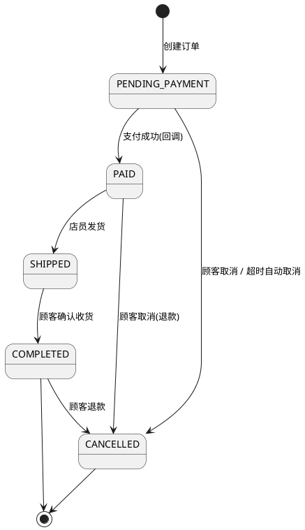

代码里每个操作都会先校验「当前状态是否允许」，比如发货：

```java
if (!"PAID".equals(order.getStatus()))
    throw new BusinessException("订单无法发货，当前状态：" + order.getStatus() + "（需为 PAID）");
```

> **给初学者的提醒**：任何「有状态」的实体（订单、工单、审批流）都建议先画状态机，再写代码。状态机能帮你穷举「哪些转换合法、哪些非法」，避免出现「已取消的订单又被发货」这类 bug。

### 5.6 并发安全之一：库存乐观锁（防超卖）

**问题**：商品只剩 1 件，两个人同时下单。如果代码是「先查库存=1，够 → 再扣成 0」，两个请求**可能都查到 1**、都判断「够」、都扣，结果库存变成 **-1**，超卖了。

**做法**：用**乐观锁**。不加真正的锁，而是把「检查 + 扣减」合并成**一条原子 SQL**，靠数据库行锁保证原子性：

```sql
UPDATE product
SET stock = stock - #{quantity}, version = version + 1
WHERE id = #{id} AND version = #{version} AND stock >= #{quantity} AND deleted = 0
```

防超卖的核心是 **`stock >= #{quantity}`** 这个条件——库存不够时这条 SQL **影响 0 行**，扣不动，自然不会变负数。

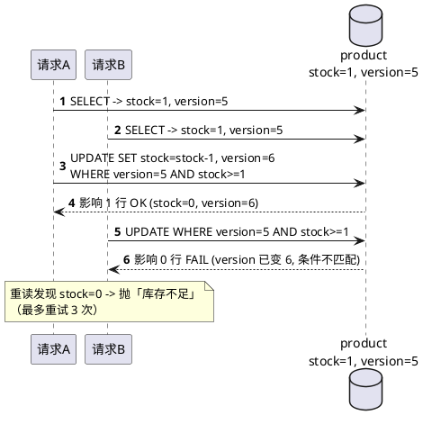

**关键代码**（`OrderServiceImpl`）：

```java
private void deductStockWithOptimisticLock(Long productId, int quantity) {
    for (int attempt = 0; attempt < 3; attempt++) {           // 最多重试 3 次
        Product product = productMapper.selectById(productId); // 每次重读最新 stock/version
        if (product == null) throw new BusinessException("商品不存在或已下架");
        if (product.getStock() < quantity) throw new BusinessException("库存不足"); // 真不够，直接拒，不重试
        int rows = productMapper.updateStockWithVersion(productId, quantity, product.getVersion());
        if (rows > 0) return;          // 影响 1 行 = 扣减成功
        // 影响 0 行 = version 被别人抢先改了 -> 重读后重试
    }
    throw new BusinessException("库存更新失败，请重试");
}
```

**给初学者的提醒**：

- **乐观锁 vs 悲观锁**：悲观锁是「我先把行锁住，别人等着」（`SELECT ... FOR UPDATE`），适合冲突激烈的场景；乐观锁是「大家都试，谁的 version 对谁赢，输的重试」，适合冲突不激烈的场景（电商库存通常用乐观锁，性能好）。
- 这里 `version` 字段和 `stock >= q` 其实**职责不同**：`stock >= q` 是「业务护栏」（防超卖），`version` 是「并发护栏」（检测这行有没有被别人改过）。纯扣减场景光靠 `stock >= q` 就够防超卖了，`version` 主要为「店员手动设库存绝对值」那种没有天然护栏的场景服务。这个细节在 [重要决策 #45](./重要决策说明.md) 有非常详细的诚实剖析，强烈推荐读。
- 恢复库存（取消订单）用的是 `stock = stock + q` 的原子自增，加库存永远安全，不需要 version。

### 5.7 并发安全之二：优惠券领取分布式锁（防超发）

**问题**：和库存类似，但更复杂——领券要做**多步**：① 查剩余数量 → ② 查「这人是不是已经领过」→ ③ 扣减数量 → ④ 创建券记录。其中第②步「防重复领取」是个「先查后插」的组合操作，**乐观锁那种单条 SQL 搞不定**（你没法用一条 `WHERE` 表达「这人还没领过」）。

**做法**：用 **Redis 分布式锁**把整段临界区**串行化**，同一个券组同一时刻只有一个请求能进。

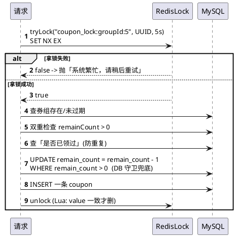

**关键代码**（`CouponServiceImpl.claimCoupon`）：

```java
String lockKey = "coupon_lock:groupId:" + groupId;
String lockValue = UUID.randomUUID().toString();           // 标识「这把锁是我的」
if (!redisLockUtil.tryLock(lockKey, lockValue, 5)) throw new BusinessException("系统繁忙，请稍后重试");
try {
    CouponGroup group = couponGroupMapper.selectById(groupId);          // 1. 存在
    if (group.getExpireAt() != null && group.getExpireAt().isBefore(now)) throw ...; // 2. 未过期
    if (group.getRemainCount() <= 0) throw new BusinessException("优惠券已被抢完"); // 3. 双重检查
    if (count(领过的) > 0) throw new BusinessException("您已领取过该优惠券");       // 4. 防重复
    int rows = couponGroupMapper.update(null, new UpdateWrapper<CouponGroup>()
            .eq("id", groupId).gt("remain_count", 0)                    // 5. DB 守卫：> 0 才减
            .setSql("remain_count = remain_count - 1"));
    if (rows == 0) throw new BusinessException("优惠券已被抢完");
    save(Coupon.builder().groupId(groupId).userId(userId).status("UNUSED").build()); // 6. 建券
} finally {
    redisLockUtil.unlock(lockKey, lockValue);              // 一定要在 finally 释放
}
```

锁工具本身（`RedisLockUtil`）的两个要点：

```java
// 加锁：SET key value NX EX —— NX 保证互斥(不存在才设)，EX 防死锁(持有者宕机也会自动过期)
public boolean tryLock(String key, String value, long expireSeconds) {
    return Boolean.TRUE.equals(
        stringRedisTemplate.opsForValue().setIfAbsent(key, value, expireSeconds, TimeUnit.SECONDS));
}
// 解锁：用 Lua 脚本保证「判断是不是我的锁 + 删除」是原子的，防止误删别人的锁
private static final DefaultRedisScript<Long> UNLOCK = new DefaultRedisScript<>(
    "if redis.call('get', KEYS[1]) == ARGV[1] then return redis.call('del', KEYS[1]) else return 0 end", Long.class);
```

**给初学者的提醒**：

- **为什么库存用乐观锁、领券用分布式锁？** 判断原则：**单步操作 + 能写成单条原子 SQL → 乐观锁**；**多步业务流程 + 含「先查后改」的不变量 → 分布式锁**。这是 [重要决策 #46](./重要决策说明.md) 的核心结论，面试讲出来很加分。
- **锁值用 UUID + Lua 解锁**：如果直接 `DEL key`，可能删掉别人的锁（你的锁过期了，别人拿到了同名锁，你一删就把别人的删了）。所以解锁要先确认「这把锁的 value 还是我当初设的 UUID」。
- **DB 守卫 `remain_count > 0` 是最后防线**：因为锁是在事务提交前释放的，理论上有个极小窗口可能读到旧值，光靠锁仍可能超发 1 个。加上这个 SQL 条件，即使读到旧值也减不成负数。**双保险**思想。

### 5.8 多优惠券叠加计价（穷举最优顺序）

**问题**：一单可以用多张券（如「9 折券」+「满 100 减 20」）。但**先打折再减、还是先减再打折，金额不一样**！该听谁的？

**做法**：券分三类——`DISCOUNT`（折扣，乘法）/ `FULL_REDUCTION`（满减，减法，有门槛）/ `DIRECT_OFF`（直减，减法，无门槛）。规则：**同类型最多一张，不同类型可叠加**。后台**穷举所有应用顺序**，取「折扣最大」那种（对用户最优）。

```java
// util/CouponCalculator.java（纯函数，便于单测）
// 对每一种券的排列顺序，从总额开始链式计价：折扣券乘 value，满减/直减券减 value，
// 每步四舍五入到分、以 0 兜底；最后取所有排列中「实付最低」的那个
public static Result calculate(BigDecimal total, List<CouponSpec> coupons) { /* 全排列枚举 */ }
```

为什么敢穷举？因为「同类型限一张」意味着券最多 3 张，排列最多 6 种，开销可忽略。穷举的好处是**绝对正确、不用费脑子证明哪种顺序最优**。

> 还提供了一个**下单前试算接口** `POST /api/orders/coupon-preview`：前端选好券先预览能省多少，但**下单时后台会重新算一遍**，绝不信任前端传来的金额。这是「**前端展示可以信，但钱必须后端重算**」的安全铁律。

### 5.9 模拟支付：异步回调 + 验签 + 幂等（最像真实第三方支付的一块）

**问题**：真实的支付宝/微信支付，**结果不是同步返回的**——你发起支付后，支付平台**过一会儿才异步回调**你的服务器告诉你「付成功了」。这就带来三个工程难题：① 怎么处理异步回调；② 怎么确认回调真的是支付平台发的（防伪造）；③ 同一笔回调被发多次怎么办（防重复改单）。

本项目用一个**可插拔的模拟支付网关**，把这三点全复刻了一遍（用了真实支付的标准姿势），只是没真连支付宝。

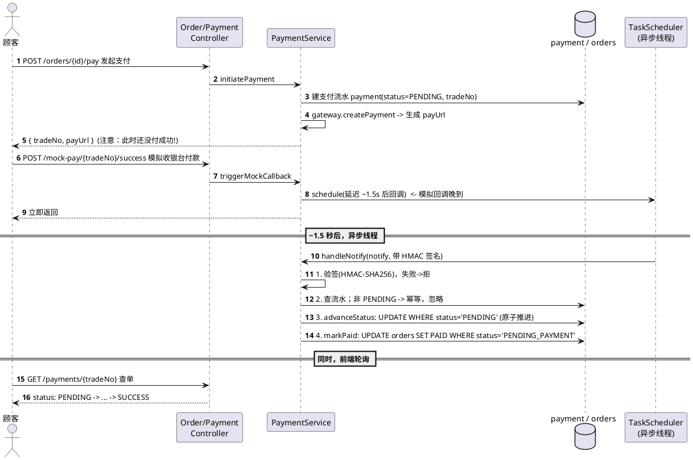

**关键代码**（`PaymentServiceImpl.handleNotify`，回调处理的三道关卡）：

```java
@Transactional
public void handleNotify(PaymentNotifyRequest notify) {
    if (!paymentGateway.verifyCallback(notify))                      // 1 验签：防伪造
        throw new BusinessException("支付回调验签失败");
    Payment payment = paymentMapper.selectByTradeNo(notify.getTradeNo());
    if (payment == null) throw new BusinessException("未知交易号");
    if (!STATUS_PENDING.equals(payment.getStatus())) {               // 2 幂等：已处理过就忽略
        log.info("支付回调幂等：已是终态，忽略"); return;
    }
    if (payment.getAmount().compareTo(notify.getAmount()) != 0)      // 金额核对
        throw new BusinessException("支付金额不一致");

    // 3 原子推进：WHERE status='PENDING' 保证并发回调只有一个能成功
    int advanced = paymentMapper.advanceStatus(notify.getTradeNo(), success ? "SUCCESS" : "FAILED", ...);
    if (advanced == 0) { log.info("已被并发回调处理"); return; }
    if (success) orderMapper.markPaid(payment.getOrderId(), now);    // 订单也用 WHERE status 原子推进
}
```

**给初学者的提醒**：

- **异步回调为什么要前端轮询？** 因为发起支付时结果还没出来，前端得不停问「付好了没」。`initiatePayment` 返回的是 `PENDING`，前端轮询 `queryPayment` 直到变 `SUCCESS`。这就是支付宝接入的标准姿势。
- **幂等**=同一操作执行多次和执行一次效果相同。支付平台为保证送达会**重复发回调**，所以「订单不能因为收到 5 次回调就被改 5 次状态」。这里用 `WHERE status='PENDING'` 的原子 UPDATE 实现——第一次能改，后面几次影响 0 行、自动忽略。
- **`PaymentGateway` 是接口**，`MockPaymentGateway` 是实现。将来真要接支付宝，**只换一个实现类**就行，业务代码不动。这是「**面向接口编程 + 依赖倒置**」的实战，留好了扩展缝。
- **回调线程没有 `SecurityContext`**（它是 `TaskScheduler` 异步线程，不是 HTTP 请求线程），所以回调路径**不做登录鉴权**，靠 **HMAC 签名**来确认来源合法。鉴权放在 REST 路径（`initiatePayment`/`queryPayment`）。呼应 [4.2](#42-三条入口通道)。

### 5.10 三级缓存（防穿透 / 雪崩 / 击穿）

**问题**：商品详情、分类树这类**读多写少**的数据，每次都查 MySQL 浪费。加缓存能扛住热点读，但缓存有三个经典坑：穿透、雪崩、击穿。

**做法**：`CacheUtil.getOrLoad` 封装了「**L1 本地 Caffeine → L2 Redis → DB**」的三级读穿透，并一次性把三个坑都防了。

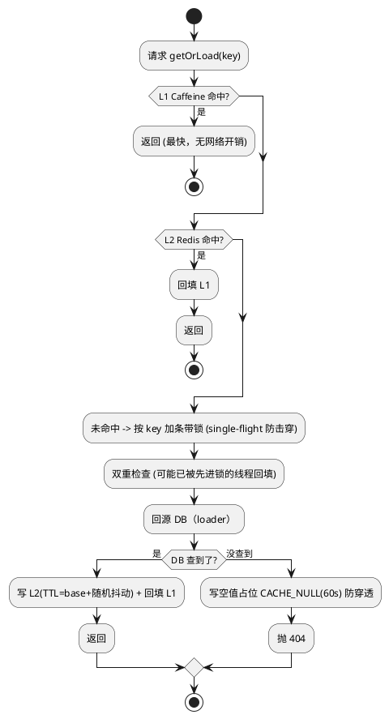

**关键代码**（`CacheUtil.getOrLoad` 单实体版）：

```java
public <T> T getOrLoad(String key, long baseTtl, long randomRange, Supplier<T> loader, Class<T> clazz) {
    T v = decode(readThrough(key), key, clazz);   // readThrough: 先 L1 再 L2，命中即返回
    if (v != null) return v;
    synchronized (stripeFor(key)) {                // 击穿防护：同一 key 只放一个线程回源，其余等待复用
        v = decode(readThrough(key), key, clazz);  // 双重检查
        if (v != null) return v;
        T loaded = loader.get();                    // 回源 DB
        if (loaded == null) {
            put(key, NULL_SENTINEL, 60);            // 穿透防护：查不到也缓存一个空占位 60s
            throw new BusinessException(Result.CODE_NOT_FOUND, "资源不存在");
        }
        put(key, serialize(loaded), randomTtl(baseTtl, randomRange)); // 雪崩防护：TTL 加随机抖动
        return loaded;
    }
}
```

**三个坑分别怎么防的**（必背）：

| 坑                 | 是什么                                              | 怎么防                                                            |
| ------------------ | --------------------------------------------------- | ----------------------------------------------------------------- |
| **缓存穿透** | 查一个**根本不存在**的 key，每次都打到 DB     | 查不到也缓存一个**空值占位**（60s），后续直接返回 404       |
| **缓存雪崩** | 大量 key**同一时刻过期**，瞬间全打到 DB       | TTL = 基础值 +**随机抖动**，把过期时间打散                  |
| **缓存击穿** | 一个**热点 key** 刚过期，瞬间大量请求同时回源 | **single-flight**：同 key 只放一个线程查 DB，其余等结果复用 |

**写操作要主动失效缓存**（保证一致性）：改商品就清 `product:detail:{id}`，发评论就按前缀清 `product:reviews:{id}:*`。

**给初学者的提醒**：

- **缓存最难的不是「存」，是「失效」**——什么时候清、清哪些 key，决定了数据一致性。本项目对每个缓存点都明确了失效触发时机（见 [实现说明.md](./实现说明.md) 缓存表）。
- 哪些**不缓存**也是设计：优惠券剩余数量变化太频繁、商品搜索参数组合太多（key 会爆炸），就不缓存。**不是所有数据都该进缓存。**
- 这块代码比文档还新（已从「单层 Redis」升级到「Caffeine+Redis 三级」），看代码时以 `CacheUtil.java` 为准。

### 5.11 实时客服（WebSocket / STOMP）

**问题**：HTTP 是「请求-响应」，服务端没法主动推消息给客户端。但客服聊天需要**双向实时**——客服回的话要立刻推给买家。

**做法**：用 **WebSocket**（全双工长连接）+ **STOMP**（一个跑在 WebSocket 上的消息协议，类似消息队列的「订阅/发布」）。

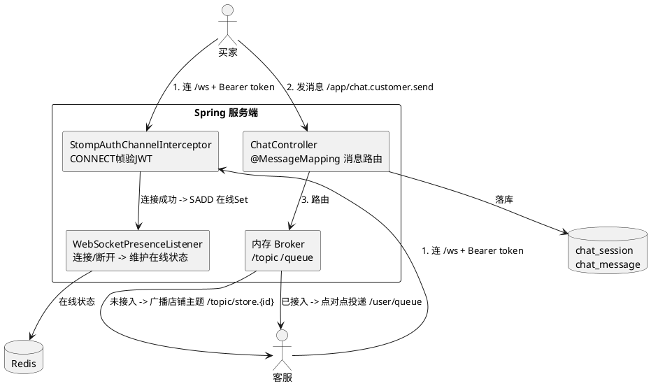

几个核心设计：

- **CONNECT 帧鉴权**：WebSocket 握手（HTTP 那步）`SecurityConfig` 直接放行，真正的 JWT 鉴权在 STOMP 的 CONNECT 帧里做（`StompAuthChannelInterceptor`）。再次呼应「WS 线程没有 SecurityContext」。
- **会话认领制**：一个买家咨询，店里多个客服**抢单**。用 `UPDATE chat_session SET assignee_staff_id=? WHERE id=? AND assignee_staff_id IS NULL` 的**原子更新**实现——只有一个客服能 UPDATE 成功（影响 1 行），其余影响 0 行，防止两个客服撞单。
- **按归属路由**：消息没人接 → 广播给整个店铺主题（所有客服都能看到并抢单）；已被某客服接入 → 点对点只发给那个客服。
- **在线状态**：用 Redis Set 维护谁在线（`WebSocketPresenceListener` 监听连接/断开事件）。
- **历史消息游标分页**：用 `WHERE id < #{lastId} ORDER BY id DESC` 向上翻页，而不是 `LIMIT OFFSET`（后者翻到后面会越来越慢且可能错位）。

> 这块概念较多，想深入看 [学习笔记-推荐算法与实时客服.md](./学习笔记-推荐算法与实时客服.md) 和 [实现说明.md](./实现说明.md) 的客服章节。

### 5.12 推荐算法（item-based 协同过滤）

**问题**：「看了这个商品的人还看了……」「猜你喜欢」怎么算？

**做法**：**item-based 协同过滤**——核心思想是「**经常被同一批人一起买的两个商品，就相似**」。

1. **离线预计算**：定时（每日 03:00）扫描所有「用户-商品-订单状态」交互，用**加权余弦相似度**算出每个商品和其他商品的相似度，存进 `product_similarity` 表。
2. **多级缓存**：`product_similarity` 表是「真相来源」，Redis ZSET（有序集合，天然按分数排序）做热读缓存，没命中就回表查再回填（read-through）。
3. **冷启动兜底**：新商品没有相似数据时，降级为「同类目热销 → 全站热销」。

加权余弦的「权」体现在：不同订单状态贡献不同信任度——`已支付/已发货/已完成 = 1.0`，`待支付 = 0.5`，`已取消 = 0.3`（取消的订单也有一点信号，但很弱）。

```
相似度(A, B) = (A、B 两个商品的用户权重向量点积) / (各自向量模长之积)
```

> 算法原理详见 [学习笔记-推荐算法与实时客服.md](./学习笔记-推荐算法与实时客服.md)。两个接口：`GET /api/products/{id}/recommendations`（相关推荐，开放）、`GET /api/recommendations`（个性化，需登录，会排除已购）。

### 5.13 定时任务：超时未支付订单自动取消

**问题**：下单就扣了库存，但用户一直不付钱，库存就被「占着茅坑」了。

**做法**：`@EnableScheduling` + `@Scheduled(fixedDelay=60000)` 每分钟扫一次，把「`PENDING_PAYMENT` 且创建超过 N 天」的订单自动取消并**恢复库存和优惠券**。

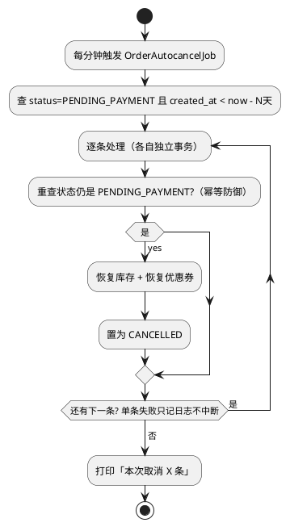

**给初学者的提醒**：

- **逐条独立事务 + try-catch**：一条订单处理失败（比如数据异常）只回滚那一条、记日志继续，不会因为一条坏数据让整批都失败。这比「整批一个大事务」健壮得多。
- **幂等防御**：执行取消前再查一次状态，因为「扫描到」和「执行取消」之间，用户可能刚好把钱付了。不重查就可能把已支付订单误取消。
- 保留天数 `bluewhale.order.auto-cancel-days` 写在配置里（默认 14），**演示时可以调成 1 天**方便观察效果，不硬编码。

---

### 5.14 AI 语义搜索：outbox 可靠同步 + 向量检索

**问题**：关键词搜索 `GET /api/products`（商品名 `LIKE`）搜「降噪耳机」搜不到「无线蓝牙耳机」——它只认字面，不懂**语义**。想让「做饭用的调味料」也能召回「橄榄油 / 酱油」，需要另一条链路：把商品和查询都变成**向量**（一串能表达语义的数字），在**向量库**里按「距离最近」检索。

**做法**：新增一条**独立**的语义搜索链路，三块拼起来——

1. **embedding（文字 → 向量）**：调通义 `text-embedding-v3`，把「商品名 + 类目名」变成 1024 维向量。
2. **向量库 Qdrant**：存所有商品向量，查询时算余弦距离找最近的。
3. **transactional outbox（可靠同步）**：商品一旦增删改，怎么保证向量库也跟着更新？这是最核心的学习点。

**核心难点：MySQL 和 Qdrant 是两个库，怎么保证数据一致？**

天真的做法是「写完 MySQL 顺手调一下 Qdrant」。但如果 MySQL 写成功、Qdrant 那步网络抖动失败了呢？数据就不一致了，而且商品写操作还被 AI 链路拖慢/拖挂。**outbox 模式**解决它：

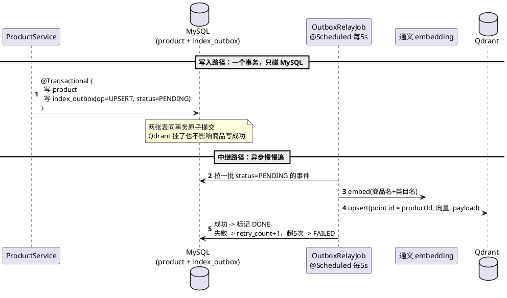

**关键点：为什么这样就可靠？**

- **同事务原子性**：商品写和「待同步事件」写在**一个事务**里，要么都成功要么都回滚，绝不会出现「商品写了但没人知道要同步」。
- **写操作永不被 AI 拖垮**：通义 / Qdrant 全挂时，商品照样写成功，事件留在 `index_outbox` 表里等中继慢慢补。**主站可用性和 AI 可用性彻底解耦**。
- **幂等 + 至少一次投递**：中继以 `productId` 作 Qdrant 的 point id，`upsert` 重复覆盖同一点、`delete` 重复无副作用。所以「中继处理成功但标记 DONE 前崩溃」→ 下轮重处理同一事件，结果一致，不怕重复。

**查询路径与优雅降级**（`SemanticSearchServiceImpl.search`）：

```java
public List<ProductListItemResponse> search(String q, Long categoryId, BigDecimal minPrice, BigDecimal maxPrice, int topK) {
    try {
        float[] vec = embeddingClient.embed(q);                          // 1. 查询词 -> 向量
        // 2. 分类/价格作为 payload 过滤「下推」到 Qdrant 侧筛（不是取回来再过滤）
        List<ScoredId> hits = vectorIndex.search(vec, new VectorSearchFilter(categoryId, minPrice, maxPrice), topK);
        List<Long> ids = hits.stream().map(ScoredId::id).toList();       // 按 score 降序
        // 3. 批量回表 + 按命中顺序重排（保住相关性次序）
        return productMapper.selectBatchIds(ids).stream()
                .sorted(Comparator.comparingInt(p -> ids.indexOf(p.getId())))
                .map(this::toListItem).toList();
    } catch (Exception e) {
        log.warn("语义搜索降级为关键词搜索：{}", e.getMessage());
        return productService.searchProducts(q, categoryId, minPrice, maxPrice); // 4. 降级！
    }
}
```

**给初学者的提醒**：

- **「过滤下推」是个重要优化**：分类/价格过滤交给 Qdrant 在向量检索时一起做（payload 过滤），而不是「取回 topK 再在 Java 里筛」。后者会导致「筛完不足 K 个」，前者从一开始就只在符合条件的向量里找最近邻。
- **优雅降级 = AI 是增强而非依赖**：embedding 或 Qdrant 任一挂了，自动回退关键词搜索，**对前端完全透明**（返回结构一样）。这是「AI 功能不能拖垮核心功能」的工程底线。
- **outbox 是分布式数据一致性的经典武器**：凡是「本地库写 + 要通知外部系统（发消息队列 / 建索引 / 调下游）」且要求可靠的场景，都可以用它。记住这个模式，比记住 Qdrant 的 API 有用得多。
- 真实联调验证过纯语义召回：「做饭用的调味料」→ 橄榄油/酱油，查询词在商品名里**一个字都不出现**（详见 [实现说明.md](./实现说明.md) 联调节）。

### 5.15 RAG 导购问答：检索增强生成 + SSE 流式

**问题**：语义搜索只能返回一串商品卡。但用户问「我想给爸妈买点健康的年货，预算 200」时，更想要一句**像导购一样的推荐话术**——「给您推荐每日坚果和手工饼干，都是健康零食……」。直接问大模型行不行？不行：大模型**不知道你店里有什么货**，会一本正经地编出不存在的商品（幻觉）。

**做法**：**RAG（Retrieval-Augmented Generation，检索增强生成）**——先**检索**（复用 5.14 找到真实商品）→ 把这些商品**塞进给大模型的提示词**里 → 让大模型**只根据这些真实商品**生成推荐话术。「先查资料再答题，不许瞎编」。

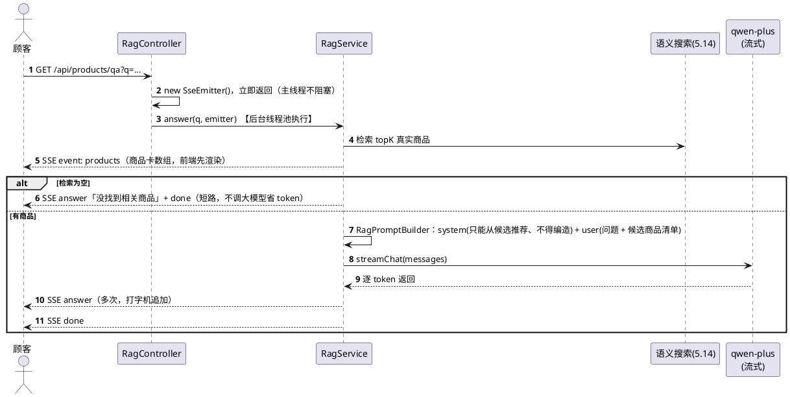

**关键点 1：严格 grounding（防幻觉）** —— 全靠两件事：

1. **只喂检索结果**：给大模型的上下文里只有检索到的真实商品，不喂全库、不让它自由发挥。
2. **system 提示强约束**：「你只能根据下面列出的候选商品推荐，**不得推荐清单之外的任何商品**」。

**关键点 2：SSE 流式（打字机效果）** —— 生成是逐 token 产出的，不必等整段生成完再返回：

```java
// RagController：主线程秒返回一个 SseEmitter，真正的活儿丢给后台线程池
@GetMapping(value = "/api/products/qa", produces = MediaType.TEXT_EVENT_STREAM_VALUE)
public SseEmitter qa(@RequestParam String q, @RequestParam(defaultValue = "5") int topK) {
    SseEmitter emitter = new SseEmitter(ragProperties.getEmitterTimeoutMs());
    ragStreamExecutor.execute(() -> ragService.answer(q, topK, emitter)); // 不阻塞容器请求线程
    return emitter;
}
// RagService.answer：先推 products，再流式推 answer
emitter.send(SseEmitter.event().name("products").data(products));
chatClient.streamChat(messages, delta -> emitter.send(SseEmitter.event().name("answer").data(delta)));
emitter.send(SseEmitter.event().name("done").data(""));
```

**给初学者的提醒**：

- **RAG 的本质是「给大模型开卷考试」**：大模型本身不知道你的业务数据，RAG 把「私有数据」检索出来塞进提示词，让它基于事实回答。这是企业落地大模型最主流的姿势（比微调便宜、数据实时）。
- **一份数据两用**：检索结果 `List<ProductListItemResponse>` 既作为 `products` 事件的商品卡推给前端，又作为大模型的上下文，不重复检索。
- **空结果短路省 token**：检索不到商品就不调大模型了，直接回一句提示。调用大模型是要花钱的，能省则省。
- **可插拔生成**：`ChatCompletionClient` 是接口（呼应 `PaymentGateway`/`EmbeddingClient`），现在是 `QwenChatClient`，想换 DeepSeek 只改配置 `base-url`/`model`/`key`，代码不动。
- 概念详解见 [学习笔记-AI应用：语义搜索、RAG与Agent.md](./学习笔记-AI应用：语义搜索、RAG与Agent.md)。

### 5.16 AI 导购 Agent：手写多轮循环 + 工具调用 + 生产化护栏

**问题**：RAG 是**单轮**的——检索一次、回答一次。但真实导购是**多轮**的：用户问「有没有适合送人的、200 块以内还有货的礼盒？」，导购得**自己决定**先搜商品、再查库存、再查有没有优惠券，**分几步**做完再回答。这需要让大模型**自主决定调用哪些工具、调几次**——这就是 **Agent**。

**做法**：**手写一个 Agent 循环**（不引 Spring AI / LangChain4j 框架，核心学习目标就是「自己实现一遍」）。给大模型配 6 个**工具**（本质是它能调用的函数），让它在循环里「思考 → 调工具 → 看结果 → 再思考」，直到能回答为止。

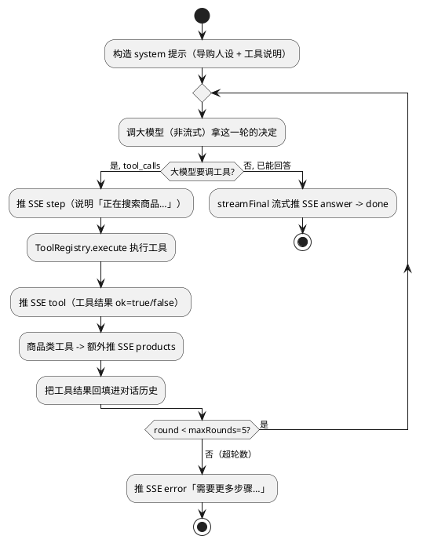

**6 个工具（越权防护是重点）**：

| 工具 | 干什么 | 越权保护 |
|---|---|---|
| `search_products` | 语义搜索商品 | 公开只读，无需身份 |
| `get_product_detail` | 查商品详情 | 公开只读 |
| `check_stock` | 查库存 | 公开只读 |
| `list_claimable_coupons` | 查可领的券 | 公开只读 |
| `get_my_orders` | 查**我的**订单 | **强制** `ctx.userId()` 过滤 |
| `list_my_coupons` | 查**我的**券 | **强制** `ctx.userId()` 过滤 |

```java
// 个人数据工具：userId 从「上下文」取，绝不从大模型的参数取
public String execute(Map<String, Object> args, AgentContext ctx) {
    // 注意：这里用 ctx.userId()（服务端认证得来的身份），而不是 args.get("userId")
    List<OrderResponse> orders = orderService.getMyOrders(ctx.userId(), page, size);
    return objectMapper.writeValueAsString(orders);
}
```

> 🔴 **这是 Agent 安全的核心**：如果 `userId` 让大模型从参数里传，用户就能诱导它「查一下用户 123 的订单」造成**越权**。正确做法是**个人数据的身份永远从服务端认证上下文取，工具参数无权指定**。这条铁律和 5.3「授权在 Service 层」一脉相承。

**生产化护栏三件套**（让 AI 功能能真正上线）：

| 护栏 | 用什么 | 解决什么 |
|---|---|---|
| **限流** | Redis Lua 固定窗口（`INCR + 首次 EXPIRE`，原子），20 req/60s | 防刷、防大模型账单被打爆；超限返 `{code:429}` |
| **熔断/重试** | Resilience4j：embedding 熔断+重试→失败降级关键词搜索；LLM 只熔断不重试→快速失败推 error | 下游 AI 抖动时不无限等待、不雪崩 |
| **监控** | Micrometer 指标 + Actuator `/prometheus` | 可观测：工具调用次数、Agent 轮数、限流拒绝数 |

**给初学者的提醒**：

- **Agent = 大模型 + 循环 + 工具**。别把它想神秘：本质就是「让大模型在一个 while 循环里反复决定调哪个函数，把函数结果喂回去，直到它说『我能回答了』」。你已经能看懂这个循环，就理解了 Agent 的 80%。
- **为什么手写而不用框架？** Spring AI / LangChain4j 的抽象还在频繁变动，手写循环更透明可控，也更利于**学会原理**（决策 [#59](./重要决策说明.md)）。生产项目里框架能省事，但学习阶段自己写一遍价值更高。
- **LLM 熔断为什么不重试？** 因为大模型调用又慢又贵，而且 SSE 连接已经开着，重试会让用户干等。**快速失败、推个 error 让用户重发**，比死等好（决策 [#62](./重要决策说明.md)）。
- **`hasAuthority("ADMIN")` 不是 `hasRole("ADMIN")`**：本项目 JWT 里存的是裸角色串 `"ADMIN"`（无 `ROLE_` 前缀），`hasRole` 会自动补 `ROLE_` 前缀导致鉴权恒拒。这是个很容易踩的坑（决策 [#63](./重要决策说明.md)）。
- 完整原理见 [学习笔记-AI应用：语义搜索、RAG与Agent.md](./学习笔记-AI应用：语义搜索、RAG与Agent.md)。

---

## 六、数据库设计速览

18 张表，核心实体关系如下（只画主线交易表；客服 `chat_session`/`chat_message`、推荐 `product_similarity`、支付 `payment`、索引 `index_outbox` 等进阶模块表未画）：

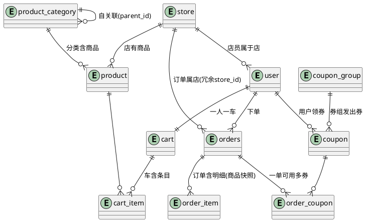

几个设计要点（都在 [重要决策说明.md](./重要决策说明.md) 有详细原因）：

| 设计                                                    | 原因                                      |
| ------------------------------------------------------- | ----------------------------------------- |
| 订单表叫 `orders` 不叫 `order`                      | `order` 是 MySQL 保留字（`ORDER BY`） |
| `orders` 冗余地址快照、`order_item` 冗余商品名/单价 | 历史订单定格，不随改址/改价变化           |
| `product_category.parent_id` 自关联                   | 单表实现无限级嵌套分类                    |
| `review.parent_id` 自关联                             | 一张表同时存「评价」和「楼层回复」        |
| `coupon_group.store_id = NULL` 表示全局券             | 不用为「店铺券/全局券」建两张表           |
| `product.version` 字段                                | 库存乐观锁用                              |
| `order_coupon` 关联表                                 | 支持「一单多券」叠加                      |
| `payment` 独立于 `orders`（一单 1:N 流水）          | 一个订单可多次发起支付，流水可追溯（V6）  |
| `index_outbox` 事件表                                 | 商品变更与「待同步向量库」事件同事务写入、中继异步消费（V7，见 §5.14） |

> 建表脚本由 **Flyway** 管理（`src/main/resources/db/migration/V1~V7`），启动时自动按序执行。改表结构**绝不能改已发布的 V1**，只能新增 `V8__xxx.sql`。机制见 [数据库迁移指南.md](./数据库迁移指南.md)。

---

## 七、测试体系（顺带学测试怎么写）

- **以纯 Mockito 单测为主**：`@ExtendWith(MockitoExtension.class)` + `@InjectMocks`，**不启动 Spring、不连数据库**，把 Mapper 全 mock 掉，只验业务逻辑。好处是跑得飞快、CI 里无依赖。
- **纯函数单独测**：像 `CosineSimilarity`（余弦相似度）、`CouponCalculator`（优惠券计价）这种纯计算逻辑抽成纯函数，喂输入断言输出，最好测。
- **集成测试覆盖事务/WebSocket**：客服用 `@SpringBootTest + WebSocketStompClient` 做端到端测试（需要 MySQL+Redis）。
- 项目沉淀了一堆 MyBatis Plus 3.5.9 的测试坑（如 `ServiceImpl.baseMapper` 因泛型擦除注入不进去，要用 `ReflectionTestUtils` 手动注入），**写测试前先读 [debug记录.md](./debug记录.md)**。

> 给初学者：**纯 Mockito 单测的代价是 `@Transactional` 不生效**（没有 Spring 容器就没有事务代理），所以事务行为得靠集成测试覆盖。这是个常见误区——别以为单测过了事务就没问题。

---

## 八、给学习者的总结：这个项目值得你学什么

如果只记住几点，记住这些「可迁移」的工程思想：

1. **分层 + 单一职责**：Controller 管路由、Service 管业务+授权、Mapper 管数据，过滤器只认证不授权。
2. **快照思想**：历史数据（订单）要定格，不能随上游变化。
3. **先校验后写库 + 事务**：把只读校验全前置，写操作集中在后段并包进事务。
4. **并发安全有套路**：单步原子操作用乐观锁，多步业务流程用分布式锁，最后都用 DB 守卫兜底。
5. **幂等**：任何「可能被重复触发」的操作（支付回调、定时任务）都要做幂等。
6. **缓存三件套**：穿透（空值占位）、雪崩（TTL 抖动）、击穿（single-flight）。
7. **面向接口编程**：`PaymentGateway` 留好扩展缝，将来换实现不动业务。
8. **配置化而非硬编码**：超时天数、回调延迟等都走配置。
9. **文档驱动**：每个决策都留「为什么」，方便自己和别人复盘。
10. **AI 是增强而非依赖**：语义搜索/RAG/Agent 全部做了「AI 挂了自动降级或推 error」，绝不让 AI 抖动拖垮主站；用 outbox 解耦「主库写」与「向量索引同步」。
11. **RAG 防幻觉靠 grounding**：只喂检索到的真实数据 + system 强约束「不许编造」，让大模型开卷考试而非自由发挥。
12. **Agent 就是「大模型 + 循环 + 工具」**：手写一遍就懂了；个人数据工具的身份务必从服务端上下文取，绝不让大模型的参数指定，防越权。

---

## 九、配套文档导航

| 想了解                           | 看这个                                                                  |
| -------------------------------- | ----------------------------------------------------------------------- |
| 一页纸概览                       | [项目说明.md](./项目说明.md)                                               |
| 新会话/接手怎么快速上手          | [上手指南.md](./上手指南.md)                                               |
| 各模块业务逻辑细节（怎么做的）   | [实现说明.md](./实现说明.md)                                               |
| 技术决策的原因（为什么这么做）   | [重要决策说明.md](./重要决策说明.md)                                       |
| 完整接口规范                     | [api-spec.md](./api-spec.md)                                               |
| 前端怎么对接（鉴权/错误码/枚举） | [frontend-handoff.md](./frontend-handoff.md)                               |
| 踩过的坑（写测试前必读）         | [debug记录.md](./debug记录.md)                                             |
| 推荐算法 & 实时客服原理          | [学习笔记-推荐算法与实时客服.md](./学习笔记-推荐算法与实时客服.md)         |
| 模拟支付 & 异步回调原理          | [学习笔记-模拟支付网关与异步回调.md](./学习笔记-模拟支付网关与异步回调.md) |
| AI 语义搜索 / RAG / Agent 原理   | [学习笔记-AI应用：语义搜索、RAG与Agent.md](./学习笔记-AI应用：语义搜索、RAG与Agent.md) |
| 数据库迁移机制                   | [数据库迁移指南.md](./数据库迁移指南.md)                                   |
| 开发进度 / 后续规划              | [进度.md](./进度.md) / [下一阶段路线图.md](./下一阶段路线图.md)               |

> 本手册聚焦「学习与讲解」。如果你要动手改代码，改完记得按 [上手指南.md](./上手指南.md) 的规范同步更新对应文档。
